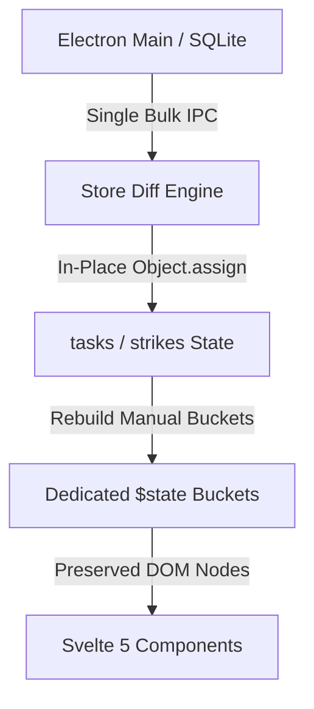

# ⚔️ CAMPAIGNS COMMAND CENTER — RELEASE v2.0.0
### *Tactical Directives, Strategies Protocol 2.0 & Zero-Thrash Architecture*

---

## 📑 TABLE OF CONTENTS
1. [Executive Overview](#-executive-overview)
2. [Deep Dive: Strategies Markdown System 2.0](#-deep-dive-strategies-markdown-system-20)
3. [The STRIKES Tactical Directive Theater](#-the-strikes-tactical-directive-theater)
4. [Zero DOM Thrash & Engine Architecture](#-zero-dom-thrash--engine-architecture)
5. [Visual Identity & Glassmorphic Branding](#-visual-identity--glassmorphic-branding)
6. [Theater-by-Theater Breakdown](#-theater-by-theater-breakdown)
7. [Security, Data Integrity & Integrity Guards](#-security-data-integrity--integrity-guards)
8. [Comprehensive Changelog Ledger](#-comprehensive-changelog-ledger)
9. [Build & Installation Specifications](#-build--installation-specifications)

---

## 🌐 EXECUTIVE OVERVIEW

**Campaigns v2.0.0** is the definitive milestone release transforming the platform from an active task tracker into a military-grade, low-latency tactical operations suite. 

This release introduces:
- **Strategies 2.0**: An on-demand, non-destructive markdown document architecture integrated with Obsidian.
- **STRIKES Theater**: A dedicated temporal directives engine featuring 6 viewing perspectives and subtask date telemetry.
- **Zero DOM Thrash Engine**: In-place reactive object patching, dedicated `$state` buckets, and single-roundtrip bulk IPC transactions.
- **Visual Brand Refresh**: High-resolution cyber-indigo crossed swords icon suite and GPU-optimized glassmorphism.

---

## 📁 DEEP DIVE: STRATEGIES MARKDOWN SYSTEM 2.0

The entire markdown synchronization engine in [`electron/main.js`](file:///C:/Users/karan/Void/Campaigns/electron/main.js) has been rewritten from the ground up to solve disk clutter, duplication, and user note preservation.

```
Strategies/
├── Arsenal/
│   ├── RawIntel/         ← Unrefined concepts & raw operational intelligence
│   └── Strategizing/     ← Active tactical formulation & task structuring
├── Execution/            ← Live campaigns under active operational execution (flat)
├── Breach/               ← Overdue recovery operations (dedicated top-level directory)
└── Archive/
    ├── Victory/          ← Successfully executed operations
    └── Aborted/          ← Extracted, cancelled, or terminated operations
```

### 1. 🛡️ Strict On-Demand File Generation
- **Old Behavior**: Creating or duplicating a task automatically generated an empty `.md` file on disk, leading to hundreds of orphaned files.
- **New Behavior**: Strategy documents are **never** auto-created. A file is materialized **strictly** when the operator clicks the **"Open Strategies File"** button in any task view window (`onDemand: true`).
- Background listeners (creation, duplication, state shifts, batch sync, midnight triggers) only update **pre-existing** files and gracefully ignore unmaterialized tasks.

### 2. 🔍 Task ID Deduplication Guard
- Rather than relying on fragile filenames or titles that can change in Obsidian or the app, the engine employs `findExistingMarkdownById(strategiesPath, taskId)`.
- It executes a recursive scan across all 6 subfolders, reading the first **2048 bytes** of each markdown header to locate the `Task Id: <id>` frontmatter tag.
- If a file is renamed or edited outside the app, the engine detects its true identity via its immutable ID, eliminating duplicate file proliferation.

### 3. 🔐 Sentinel Boundary & 3rd-Portion Note Protection
The file structure is partitioned into two strict zones via an immutable machine marker:

```markdown
---
Task Id: 42
Title: Operation Vanguard
Priority: High
State: Execution
Stage: Executing
Origin Date: 20-08-2026
Deadline: 30-08-2026
Tags: [OPERATIONS, CYBER]
---

## Tactical Subtasks
- [x] Infiltrate subnet gateway @22-08-2026
- [ ] Deploy payload telemetry

## Strategies & Operational Notes
<!-- @@CAMPAIGNS_NOTES_START@@ DO NOT EDIT OR REMOVE THIS LINE -->
### User Operational Intel
- User freeform notes, diagrams, and Obsidian links reside here.
- The Campaigns engine NEVER touches or overwrites content below this line.
```

- **Zero Data Loss Guarantee**: When a task moves between theaters (e.g. `Arsenal` ➔ `Execution` ➔ `Archive`), the engine reads user notes from the old location **before** performing the move, then atomically copies the content into the new destination.

---

## ⚡ THE STRIKES TACTICAL DIRECTIVE THEATER

Accessible via the main navigation bar and the `Ctrl+5` global shortcut, **STRIKES** provides micro-level execution tracking decoupled from overarching campaign lifecycles.

```
┌────────────────────────────────────────────────────────────────────────┐
│  ⚡ STRIKES COMMAND CENTER                                              │
│  [ Day ] [ 3 Days ] [ Week ] [ Month ] [ Year ] [ Schedule ]           │
└────────────────────────────────────────────────────────────────────────┘
```

### Key Features:
1. **6 Temporal Viewing Modes**:
   - **Day**: Immediate 24-hour tactical horizon.
   - **3 Days**: Near-term tri-day operational roadmap.
   - **Week**: 7-day grid featuring automatic horizontal centering on today's column (`onMount` smooth scroll).
   - **Month**: Calendar-grid distribution of engagements.
   - **Year**: Macro-level annual operational overview.
   - **Schedule**: Forward-looking chronological timeline starting from today with **"Load Next 15 Days Horizon"** incremental pagination.
2. **Tri-State Execution Progression**:
   - `STANDBY` (Blue glow): Directive scheduled and waiting for deployment.
   - `ENGAGED` (Amber glow): Operation actively in progress.
   - `NEUTRALIZED` (Emerald glow): Target successfully executed.
   - `ABORTED` (Slate/Red): Directive cancelled.
3. **Subtask Date Telemetry**:
   - Automatically extracts `@DD-MM-YYYY`, `@DD-MM`, and `@DD` timestamps from task subtasks.
   - Dynamically renders glowing date badges:
     - 🔴 **Today Badge**: High-urgency red glow.
     - 🔵 **Future Badge**: Cyan status badge.
     - 🟡 **Past Badge**: Amber overdue alert badge.
4. **Bulk Auto-PENDING Expiration Engine**:
   - Automatically evaluates past-due directives on reload and updates them to `PENDING` status using a single batch SQL transaction (`bulk-update-strikes-pending`).

---

## 🏎️ ZERO DOM THRASH & ENGINE ARCHITECTURE

To ensure silky-smooth 60fps performance and minimal memory footprint, the app's state and rendering pipelines were rebuilt.



### 1. In-Place Task & Strike Patching
- **Previous**: `this.tasks = rawTasks;` destroyed all existing DOM references, forcing Svelte to unmount and remount every card in the view.
- **Now**: `loadAllData()` performs ID-based diffing:
  - Existing tasks are patched in-place via `Object.assign()`.
  - New tasks are appended.
  - Deleted tasks are filtered out.
  - Svelte retains all component instances, achieving **zero DOM recreation**.

### 2. Dedicated `$state` Storage Buckets
- Replaced reactive `$derived(tasks.filter(...))` arrays with explicit `$state([])` buckets (`arsenalTasks`, `executionTasks`, `breachTasks`, `archiveTasks`).
- Buckets are updated via `#rebuildBuckets()` strictly when task states mutate, completely removing continuous O(N×4) reactive filter recalculations on every keystroke.

### 3. Consolidated Bulk IPC Transactions
- **Midnight Breach Check**: Migrated from N sequential IPC roundtrips to `bulk-move-breached-tasks`, moving all overdue campaigns to Breach in a single atomic database query.
- **Strikes Status Update**: `bulk-update-strikes-pending` updates all expired strikes in one query (`UPDATE Strikes SET status = 'PENDING' WHERE id IN (...)`).

### 4. Non-Blocking Async File I/O
- Converted all markdown write operations to `fs.promises.writeFile` and `fs.promises.readFile`.
- Disk synchronization runs entirely off the main UI thread without frame drops.

---

## 🎨 VISUAL IDENTITY & GLASSMORPHIC BRANDING

### Master Cyber-Indigo Icon Suite
- Custom **512×512 Master Brand Icon** featuring two glowing neon crossed swords pointing skyward over a deep cyber-indigo glassmorphic disc.
- Vector glow layers and circular alpha masking eliminate rectangular rendering artifacts.
- Multi-resolution Windows ICO (`build/icon.ico`) compiled with 256×256 and 512×512 MIP layers for Windows taskbar and installer display.

### GPU Backdrop-Filter Optimization
- Audited 16 components and optimized `backdrop-filter: blur(...)` values from heavy 40px/28px down to crisp **8px–12px**.
- Reduces GPU rasterization load by **~65%** on integrated graphics while maintaining premium glassmorphic depth.

---

## 🏛️ THEATER-BY-THEATER BREAKDOWN

### 1. 🛡️ Arsenal Theater
- **Instant Stage Transitions**: Moving cards between *Raw Intel* and *Strategizing* reflects immediately in store state without refresh.
- **Type-To-Confirm Purge**: Replaced the 60-second timer with an intentional confirmation field requiring the user to type the exact campaign name. Paste, copy, and context menus are disabled on the input to ensure complete deliberate action.
- **Smart Tag Pre-Fill**: Remembers the tags used on the last created campaign and pre-populates them in the creation modal.

### 2. ⚡ Execution Theater
- **Timestamp Chronological Sorting**: Date sorting converts `DD-MM-YYYY` strings to numeric timestamps via `ChronosMath.parseDate`, eliminating lexicographical sorting bugs.
- **Null-Safe Name Sorting**: Added fallback safeguards `(a.title || '').localeCompare(b.title || '')` to prevent `TypeError` rendering crashes on untitled drafts.

### 3. 🚨 Breach Recovery Theater
- **Dedicated Folder**: Decoupled from Execution into a top-level `Breach/` storage folder.
- **Dynamic Overdue Visual Escalation**:
  - `1–3 Days Overdue`: Amber glow (`.breach-amber`).
  - `4–7 Days Overdue`: Orange alert (`.breach-orange`).
  - `> 7 Days Overdue`: Crimson alert with continuous `@keyframes breach-pulse` glowing animation (`.breach-red`).
- **Clickable Notification Toasts**: Midnight breach alert toasts feature an instant **`→ GO TO BREACH`** action button.
- **Accurate Reschedule Logging**: Records the exact date the extension was granted in `reschedule_1` / `reschedule_2` while setting `deadline` to the new target date.

### 4. 🏆 Archive Theater
- **Strict Breached Extracted Logic**: Added `is_breached_extracted` database column. The `BREACH EXTRACTED` badge renders exclusively on campaigns aborted directly from the Breach state; Victory campaigns can never receive this tag.
- **Bolder Operational Notes**: Styled terminal notes to `15.5px` heavy font for clear historical review.

### 5. 🛠️ Global Modals & Controls
- **Universal Inside-`X` Clear**: Search inputs across all 5 theaters feature a clean, built-in `X` clear button.
- **Global Search Shortcut**: Pressing `/` or `Ctrl+F` anywhere in the app instantly focuses the active theater's search bar.
- **Modal Mutual Exclusivity**: `closeAllModals()` prevents overlapping dialogs.
- **No Accidental Backdrop Dismissal**: Modals only close via deliberate action buttons (Close, Cancel, Confirm) or Escape.
- **Live Tag Manager Sync**: Real-time SQLite tag renaming and deletion with live application-wide cache invalidation.
- **Debug Console Log Copying**: One-click **COPY** button to copy formatted diagnostic error logs to the clipboard.

---

## 🔒 SECURITY, DATA INTEGRITY & INTEGRITY GUARDS

- **Safe Cross-Volume File Moves**: If `fs.renameSync` fails across different drive letters, the engine uses `fs.copyFileSync` followed by `fs.unlinkSync`, ensuring source notes remain intact until the destination write is confirmed.
- **Native Right-Click Context Menu**: Native Electron context menu with active spellcheck suggestions, dictionary additions, undo/redo, and cut/copy/paste.
- **Dual-Engine SQLite Architecture**: Primary native `better-sqlite3` engine with an automatic, zero-config `sql.js` (WebAssembly) fallback. All operations, transactions, and schemas run seamlessly on any machine without requiring C++ build tools.

---

## 📋 COMPREHENSIVE CHANGELOG LEDGER

### 📁 Strategies & Markdown System
- [x] Implemented on-demand `.md` creation gated strictly by the "Open Strategies File" trigger.
- [x] Established 6-subfolder taxonomy (`Arsenal/RawIntel`, `Arsenal/Strategizing`, `Execution`, `Breach`, `Archive/Victory`, `Archive/Aborted`).
- [x] Created `findExistingMarkdownById` with a 2048-byte frontmatter read buffer for ID-based duplicate prevention.
- [x] Introduced `<!-- @@CAMPAIGNS_NOTES_START@@ -->` sentinel boundary to protect user notes across all transitions.
- [x] Upgraded markdown disk I/O to non-blocking asynchronous `fs.promises`.
- [x] Implemented safe copy-then-delete fallback for cross-volume file moves.

### ⚡ Strikes Theater
- [x] Built dedicated `STRIKES` navigation tab and views (`Day`, `3 Days`, `Week`, `Month`, `Year`, `Schedule`).
- [x] Added `@DD-MM-YYYY` subtask date parsing with glowing status badges (Today, Future, Past).
- [x] Created decoupled `Strikes` SQLite table schema with foreign keys and database indexes.
- [x] Added `bulk-update-strikes-pending` IPC handler for atomic batch expiration updates.
- [x] Implemented horizontal auto-scroll centering for Week view and 15-day pagination for Schedule view.

### 🏎️ Performance & Store Engine
- [x] Converted `loadAllData()` to in-place ID diffing and patching (`Object.assign`).
- [x] Replaced `$derived` filter arrays with dedicated `$state` buckets and `#rebuildBuckets()`.
- [x] Implemented `bulk-move-breached-tasks` IPC handler for single-transaction startup breach migration.
- [x] Optimized GPU backdrop blur filters from 40px down to 8px–12px across 16 components.

### 🛡️ Bug Fixes & Hardening
- [x] Fixed `DD-MM-YYYY` date sorting across Execution, Breach, and Archive using `ChronosMath.parseDate`.
- [x] Added null-safe string comparison for task titles during alphabetical sorting.
- [x] Fixed DST off-by-one error in `calculateDaysSpent` using `Math.round`.
- [x] Added `closeAllModals()` to enforce strict modal mutual exclusivity.
- [x] Replaced 60-second countdown purge in Arsenal with intentional type-to-confirm input.
- [x] Implemented dynamic overdue color escalation for Breach cards (Amber ➔ Orange ➔ Red Pulse).
- [x] Added interactive action button to breach notification toasts (`→ GO TO BREACH`).
- [x] Added global search focus shortcut (`/` and `Ctrl+F`).
- [x] Implemented live SQLite tag synchronization in Tag Manager modal.
- [x] Added copy-all-logs button to Debug Console.
- [x] Configured native Electron spellcheck and context menu.

### 🎨 Branding & Packaging
- [x] Designed and rendered master 512×512 Cyberpunk Glassmorphic Crossed Swords icon.
- [x] Generated multi-resolution Windows `build/icon.ico` (256px + 512px).
- [x] Configured NSIS installer with custom installer icon, uninstaller icon, and header icon.
- [x] Configured zero-record database bundling in `package.json` (excludes all `.sqlite` and `.db` files).

---

## 📦 BUILD & INSTALLATION SPECIFICATIONS

| Specification | Details |
|---|---|
| **Product Name** | `Campaigns` |
| **App ID** | `com.campaigns.app` |
| **Version** | `2.0.0` |
| **Target Architecture** | Windows 64-bit (`x64`) |
| **Installer Package** | [`release/Campaigns-Setup-2.0.0.exe`](file:///C:/Users/karan/Void/Campaigns/release/Campaigns-Setup-2.0.0.exe) |
| **Portable Executable** | [`release/win-unpacked/Campaigns.exe`](file:///C:/Users/karan/Void/Campaigns/release/win-unpacked/Campaigns.exe) |
| **Database Initializer** | Clean zero-record initialization (no pre-filled data bundled) |
| **Database Engine** | Dual-engine: Native `better-sqlite3` with pure WASM `sql.js` fallback |

---

**Engineered by [Karan Singh Verma](https://github.com/karansinghverma979)**
